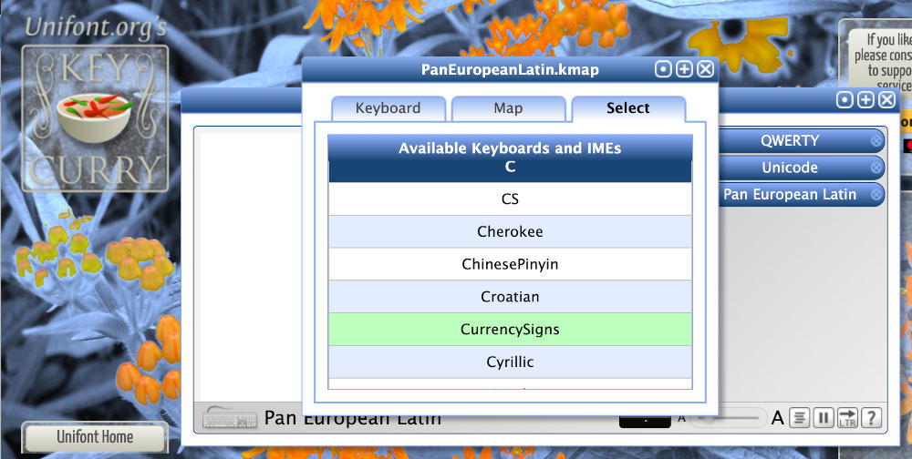

Mixcoatl Markdown Guidelines
============================
*by Ed Trager*


Markdown provides a simple way for people to write documents in a human-readable way
that can be translated by software into well-formatted, typographically-pleasing 
documents in HTML, PDF or other digital formats.

Mixcoatl uses:

  * [Showdown](http://showdownjs.com/) to support *Github Flavored Markdown* (GFM).
  * [Prism](https://prismjs.com/) for syntax highlighting of code blocks. Currently
    we include syntax grammars for at least C, C++, HTML, Javascript, Java, Python, 
    React, SQL and Typescript.
  * [Showdown-katex](https://github.com/obedm503/showdown-katex), 
    [Katex](https://katex.org/) 
    and [MathJax](https://www.mathjax.org/) to support cross-browser `MathML` 
    equation display using your choice of Latex or ASCII math syntax.

This document provides an overview of Markdown syntax that you can use to
create documents on this document server. If you need more information,
the [GitHub Flavored Markdown Spec](https://github.github.com/gfm/) 
is your friend.

Contents
--------

  * [Headers](#headers)
  * [Basic Text Formatting](#basictextformatting)
  * [Links](#links)
  * [Lists](#lists)
  * [Block Quotes](#blockquotes)
  * [Tables](#tables)
  * [Code Blocks](#codeblocks)
  * [Images](#images)
  * [Math Equations](#mathequations)
  * [Inline Equations](#inlineequations)
  * [Display Equations](#displayequations)
  * [Unicode](#unicode)
  * [HTML5 Snippets](#html5snippets)
  * [Conclusion](#conclusion)

## Headers

An `H1` header can be created by using the `=` equal sign as the symbol for underlining
some text. An `H2` header can be created by using a `-` dash for underlining. Alternatively, you can use start the line with a hash "`#`" symbol, repeating the hash
symbol to indicate the level you want, e.g.:

```markdown
Mixcoatl Markdown Guidelines
============================

An H2 Header
------------

### An H3 Header

###### An H6 Header
```

The Markdown engine will assign an `id` to each header. The `id` will be 
the lower-case spaceless transformation of the header text. For example,
"`### An H3 Header`" will be converted to the following HTML fragment:

```html
<h3 id="anh3header">An H3 Header</h3>
```

Basic Text Formatting
---------------------

This markdown syntax:

```markdown
Paragraphs are separated by blank lines.

This is a new paragraph. *Italic*, **bold**, and `monospace`.
```

*. . . produces this `HTML` result:*

Paragraphs are separated by blank lines.

This is a new paragraph. *Italic*, **bold**, and `monospace`.

Links
-----

Put the link display title in square brackets, followed immediately by
the URL in parentheses:

```markdown
The [GitHub Flavored Markdown Spec](https://github.github.com/gfm/) 
is your friend.

Here is a local link to the [Images](#images) section of this document.
```
*result:*

The [GitHub Flavored Markdown Spec](https://github.github.com/gfm/) 
is your friend.

Here is a local link to the [Images](#images) section of this document.

Lists
-----

Just use asterisks to create a bulleted list:

```markdown
Today's smoothie selection:

  * 🍎 Apple
  * 🍌 Banana
  * 🥭 Mango
  * 🍉 Watermelon
```

*result:*

Today's smoothie selection:

 * 🍎 Apple
 * 🍌 Banana
 * 🥭 Mango
 * 🍉 Watermelon

Here's a numbered list:

```markdown
 1. Call Sam
 2. Buy groceries
 3. Take dog for a walk
```

*result:*

 1. Call Sam
 2. Buy groceries
 3. Take dog for a walk

Nested lists. Indent four spaces for each level:

```markdown
 1. First, get these ingredients:

      * carrots
      * celery
      * lentils

 2. Bring water to boil in a large pot.
 3. Add all ingredients.
 4. Simmer on low heat for 45 minutes.
```

*result:*

 1. First, get these ingredients:

      * carrots
      * celery
      * lentils

 2. Bring water to boil in a large pot.
 3. Add all ingredients.
 4. Simmer on low heat for 45 minutes.
 
Block Quotes
------------

Just use the "`>`" greater-than sign, as follows. As shown, the block can
span multiple paragraphs:

```markdown
> When choosing between two evils, I always like 
> to try the one I've never tried before.
>
> — Mae West, American actress, 1893-1980
```

*result:*

> When choosing between two evils, I always like 
> to try the one I've never tried before.
>
> — Mae West, American actress, 1893-1980

Tables
------

You can construct tables as follows:

```markdown
|ASA Status| Definition                            | Example                          |
|:--------:|:-------------------------------------:|:--------------------------------:|
| ASA I    |A normal, healthy patient              |Healthy, non-smoking, no alcohol  |
| ASA II   |A patient with mild systemic disease   |Current smoker, social drinker    |
| ASA III  |A patient with severe systemic disease |Poorly controlled DM or HTN, COPD |
| ASA IV   |A patient with life-threatening disease|Congestive heart failure          |
| ASA V    |A moribund patient requiring imm. surg.|Massive trauma, respir. fail., etc|
| ASA VI   |A declared brain-dead patient whose organs are being removed for donation |
```

*result:*

|ASA Status| Definition                            | Example                          |
|:--------:|:-------------------------------------:|:--------------------------------:|
| ASA I    |A normal, healthy patient              |Healthy, non-smoking, no alcohol  |
| ASA II   |A patient with mild systemic disease   |Current smoker, social drinker    |
| ASA III  |A patient with severe systemic disease |Poorly controlled DM or HTN, COPD |
| ASA IV   |A patient with life-threatening disease|Congestive heart failure          |
| ASA V    |A moribund patient requiring imm. surg.|Massive trauma, respir. fail., etc|
| ASA VI   |A declared brain-dead patient whose organs are being removed for donation |

Consult the [GFM markdown documentation](https://github.github.com/gfm/) 
or just use raw `HTML` snippets if you need something more complicated.

Code Blocks
-----------

You can delimit code blocks with either three backticks, "`​```​`",
or three squiggles, "`~~~`". Note how the following code blocks 
are marked with language identifiers so
that the syntax highlighter will know which grammar to use:

```markdown
​`​`​`​python
import time
# Quick, count to ten!
for i in range(10):
    # (but not *too* quick)
    time.sleep(0.5)
    print i
​`​`​`​

​~​~​~​sql
SELECT * 
  FROM 
    customer c
    NATURAL JOIN purchase p
  WHERE
    c.state~*'CA|NY|MI'
    AND p.amount >= 1000;
​~​~​~​
```

*result:*

```python
import time
# Quick, count to ten!
for i in range(10):
    # (but not *too* quick)
    time.sleep(0.5)
    print i
```

~~~sql
SELECT * 
  FROM 
    customer c
    NATURAL JOIN purchase p
  WHERE
    c.state~*'CA|NY|MI'
    AND p.amount >= 1000;
~~~

Images
------

You can insert images using the following syntax:

```markdown

```

*result:*


By default, colors in images are not inverted when you switch to dark mode
as that would result in a negative of the image.
Sometimes however you might have a black-and-white line drawing or schematic
diagram where it would make sense to invert the image in dark mode. To inform 
the document server about such images, just add a CSS class of `bw_line`.
This requires that you use an `HTML` snippet, for example:

```html

```
*result:*


*result when inverted:*


Math Equations
--------------

As of this writing (2021.03.18), `MathML` mathematical 
equations will render natively in **Firefox** and **Safari**.
For **Microsoft Edge, Google Chrome, Opera**, and **Brave** browsers,
we have included the `MathJax` javascript polyfill to handle the
rendering. 

Math equations can be written using either ASCIImath or Latex syntax.

Inline Equations
----------------

Inline equations are delimited with dollar signs, "`$`":

```markdown
Inline math equations look like this: $\omega = d\phi / dt$. 

Another inline equation that everyone knows is $E=mc^2$.
```

*result:*

Inline math equations look like this: $\omega = d\phi / dt$. 

Another inline equation that everyone knows is $E=mc^2$.

Display Equations
-----------------

Note that you can mark the code block to indicate whether
you are using Latex or asciimath:

```markdown
Latex:

​`​`​`​latex
I = \int \rho R^{2} dV
​`​`​`​

ASCII math:

​`​`​`​asciimath
x = (-b +- sqrt(b^2-4ac)) / (2a)
​`​`​`​
```

*result:*

Latex:

```latex
I = \int \rho R^{2} dV
```
ASCII math:

```asciimath
x = (-b +- sqrt(b^2-4ac)) / (2a)
```

## Unicode

Mixcoatl assumes that markdown files are in Unicode UTF-8 format and generates
UTF-8 web pages, so you can include any Unicode characters you want in 
documents. Or perhaps you just want to add a smiley face emoji.
You have many options at your disposal:

  * [Emojipedia.org](https://emojipedia.org/) is an easy way to cut-and-paste
    emoji.
  * [Unifont.org's Key Curry](https://unifont.org/keycurry/) is a web
    application with numerous keyboard maps and input method engines (IME)
    that you can use to type foreign scripts, currency symbols, IPA symbols
    and numerous other symbols present in Unicode.



HTML5 Snippets
--------------

Markdown is extremely convenient as it allows you to concentrate on
what you want to say in a document rather than constantly worrying about
formatting issues. However there are still times when you might need to
include something in your document that Markdown does not handle. A great
aspect of Markdown is that when this occurs, you can simply drop HTML5
fragments into your document when you need to. For example, here is
a simple SVG animation:

```html
<div style='width:300px;margin-left:auto;margin-right:auto'>
  <svg xmlns="http://www.w3.org/2000/svg" width="300" height="100">
    <defs>
      <linearGradient id="blu">
        <stop offset="5%" stop-color="#002bdc88"></stop>
        <stop offset="95%" stop-color="#32ded488"></stop>
      </linearGradient>
    </defs>
    <rect x="0" y="0" width="300" height="100" fill="white" stroke="gray" stroke-width="1" />
    <circle cx="0" cy="50" r="15" fill="url(#blu)">
      <animateMotion
        path="M 15 0 H 285 Z"
        dur="5s" repeatCount="indefinite" />
    </circle>
  </svg>
</div>
```

*result:*

<div style='width:300px;margin-left:auto;margin-right:auto'>
  <svg xmlns="http://www.w3.org/2000/svg" width="300" height="100">
    <defs>
      <linearGradient id="blu">
        <stop offset="5%" stop-color="#002bdc88"></stop>
        <stop offset="95%" stop-color="#32ded488"></stop>
      </linearGradient>
    </defs>
    <rect x="0" y="0" width="300" height="100" fill="white" stroke="gray" stroke-width="1" />
    <circle cx="0" cy="50" r="15" fill="url(#blu)">
      <animateMotion
        path="M 15 0 H 285 Z"
        dur="5s" repeatCount="indefinite" />
    </circle>
  </svg>
</div>

Conclusion
----------

Markdown provides simplicity for everyday tasks, but you still
have access to the full power of modern HTML5 technologies when
you need them. Simplicity and power is a good combination.
Have fun!

